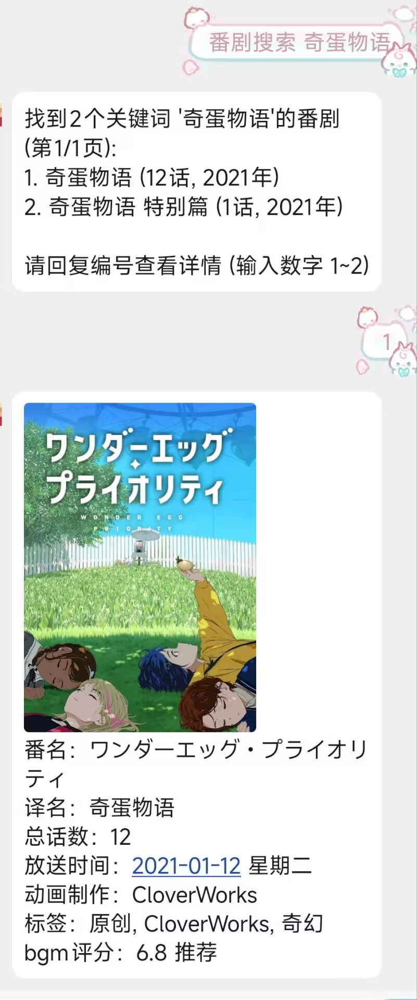

# 番剧小助手

Bangumi 番剧查询 NoneBot 插件。支持多条件组合搜索、本地用户评分管理、季度查看、随机推荐等功能，数据基于 [Bangumi](https://bgm.tv/dev)。

## 效果图
<details>
  <summary>点击展开</summary>



</details>

## 安装

使用 nb-cli 安装
```bash
nb plugin install nonebot-plugin-anime
```

或使用 pip：

```bash
pip install nonebot-plugin-anime
```

## 配置

在 NoneBot 项目的 `.env` 文件中添加：

```env
# 必填：资源目录，从网盘下载的 bangumi_resource 解压后的路径
ANIME__RESOURCE_DIR=/path/to/bangumi_resource

# 可选：HTTP 代理（国内网络访问 Bangumi API 不稳定时建议配置，留空则不开启）
ANIME__HTTP_PROXY=

# 可选：是否允许私聊使用（默认 true）
ANIME__PRIVATE_ALLOW=True

# 可选：Bangumi API 令牌（提升请求频率限制）
ANIME__BGM_API_TOKEN=xxx
```

申请Bangumi的API可以点击此链接 [Bangumi API](https://next.bgm.tv/demo/access-token)

 需[网盘](https://pan.baidu.com/s/1sYJjgkrrT9ZBJp11LAZrNg?pwd=wt3p)下载 `bangumi_resource` 资源包并解压

资源包包含预置番剧数据 (`bgm.json`)、字体文件 (`fonts/`) 。

## 适用

个人或和朋友们的小群，本质用来方便查看番剧快照，大部分操作都是基于本地

## 命令列表

| 命令                   | 说明           |
|----------------------|--------------|
| `番剧搜索 <关键词> [条件]`    | 支持条件组合搜索番剧   |
| `cv搜索 <CV名>`         | 按声优搜索配音角色    |
| `角色搜索 <角色名>`         | 按角色名搜索角色     |
| `番剧获取 <Bangumi ID>`  | 通过 ID 获取番剧数据 |
| `番剧评分 <番剧名> <特征名><分数>` | 添加或查看评分      |
| `评分搜索 <特征名> <分数>`    | 搜索用户评分       |
| `评分展示 <番剧名>`         | 展示番剧用户所有评分   |
| `评分图 <特征名>`          | 生成评分图        |
| `角色评级 <角色名> <特征名><1-5>` | 对角色评级        |
| `角色评级查看 <特征名>`        | 查看用户角色评级     |
| `角色评级图 <特征名>`         | 生成角色评级图      |
| `随机番剧 [条件]`          | 随机推荐番剧       |
| `番剧查看 <年月>`          | 查看季度番剧       |
| `标签查看 <番剧名>`         | 查看番剧标签       |
| `标签添加 <番剧名> <标签>`    | 添加标签         |
| `标签删除 <番剧名> <标签>`    | 删除标签         |

| 命令 | 说明 |
|------|------|
| `番剧群组添加 <群号>` | 添加群组白名单 |
| `番剧群组移除 <群号>` | 移除群组白名单 |
| `番剧群组列表` | 查看白名单 |
| `清理番剧缓存` | 清理图片缓存 |

群组列表默认为空，想在群聊使用需要先使用`番剧群组添加 <群号>`

## 番剧搜索 筛选条件

`番剧搜索` 支持在番剧名后追加多个筛选条件：

| 关键字 | 示例                       | 说明 |
|--------|--------------------------|------|
| `标签` | `标签 百合+日常`               | 多标签用 `+` 连接 |
| `分数` | `分数 6-8.5` / `≥8` / `≤6` | 支持范围和比较 |
| `cv` | `cv 种田梨沙`                |  |
| `导演` | `导演 若林信`                 | |
| `制作` | `制作 CloverWorks`         | |
| `staff` | `staff 脚本 野岛伸司`          | 可选限定角色 |
| `季度` | `季度 2021年1月-2022年1月`     | 时间范围筛选 |
| `类型` | `tv` / `movie`           | |
| `关键词` | `奇蛋物语`                   | 番剧名 |
